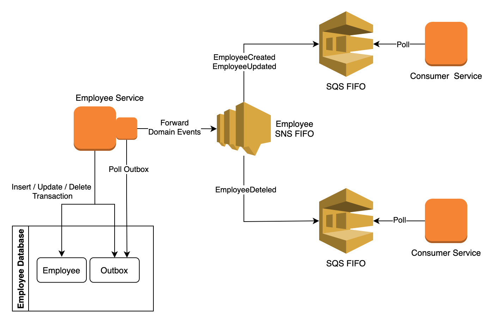

# Transactional Outbox Pattern

An example of the transactional outbox pattern. The project was implemented as part of my blog post [here](), where you 
can find more details about the pattern and implementation.

## Project structure

The project consists of the following modules:
1) [domain-events](./domain-events). Domain events shared between different services.
2) [employee-service](./employee-service). Produces domain events reliably using the transactional outbox pattern 
   and then forwards them to an SNS FIFO topic. Uses employees as an example.
3) [consumer-service](./consumer-service). It reads the published domain events by polling its own SQS FIFO queue. This 
   could be any service interested in the events published by the `employee-service`.

## Architecture



* Employee Service inserts, updates or deletes employee entities and inserts generated domain events in the outbox table in a transaction.
* Employee Service polls the outbox table and forwards events to an SNS topic. I assumed that the order of events matters, so 
  I used an SNS FIFO topic. Also, no two instances can read the outbox table at the same time.
* Each consumer service has its own SQS FIFO.
* SQS FIFO subscribes to the employee SNS FIFO. A filter can be used to only subscribe to specific event types.
* Consumer Service polls its own queue and uses the domain events.

## Running locally

You can run the project locally using docker. The configuration provided matches the 
above architecture diagram. I used localstack, so no need for an AWS account to run the project.

You first need to compile and package all modules.
```shell
mvn clean package -Dmaven.test.skip=true
```

Then you can build and start services in docker.
```shell
docker-compose up --build
```

All services should be up and running. 

## Testing locally

Now that all services are running locally we can do some manual testing.

We can create an employee.
```shell
curl --header "Content-Type: application/json" \
  --request POST \
  --data '{ "firstName": "Ioannis", "lastName": "Ioannou", "email": "email@example.com" }' \
  http://localhost:8001/employee
```

The `consumer-service-1` logs that it received the domain event `EmployeeCreated`. 

Now if we delete the employee using the UUID from the response.
```shell
curl --request DELETE http://localhost:8001/employee/8741749a-43f0-4463-a662-2ee693de749e
```

The `consumer-service-2` logs that it received the domain event `EmployeeDeleted`.


